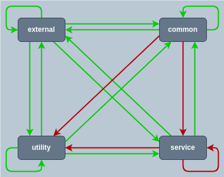

**build** : `go build -o dep-check main.go`

**type of package**



**dep-check-v2.yaml**
```yaml
external:
  - external
utility:
  - common/cmd
  - common/scripts/*
  - toolbox
common:
  - common/src/*
  - models/*
service:
  - '*'
```
This order is important because packages will be classified in first place in as **external**, then **utility**, **common** and finally **service** with the wildcard.


# GO

**ModuleName :** bitbucket/go-project

**Project structure**
```
+ go.mod
+ libraries/
| + errors/
| | \ error.go
| \ kafka/
|   \ kafka.go
+ common/
| \ cmd/
|   + security/
|   | \ security.go
|   + logging/
|   | \ logging.go
|   \ kafka/
|     \ kafka.go
\ services/
  + user/
  | \ user.go
  \ authentication/
    \ authentication.go
```
**detect packages**
|Name|path|
|:---:|:---:|
|errors|bitbucket/go-project/libraries/errors|
|kafka|bitbucket/go-project/libraries/kafka|
|security|bitbucket/go-project/common/cmd/security|
|logging|bitbucket/go-project/common/cmd/logging|
|kafka|bitbucket/go-project/common/cmd/kafka|
|user|bitbucket/go-project/services/user|
|authentication|bitbucket/go-project/services/authentication|
**Corresponding Nodes :**
|Name|Path|
|:---:|:---:|
|libraries/errors|bitbucket/go-project/libraries/errors|
|libraries/kafka|bitbucket/go-project/libraries/kafka|
|common/cmd|bitbucket/go-project/common/cmd|
|services/user|bitbucket/go-project/services/user|
|services/authentication|bitbucket/go-project/services/authentication|

# JS

**Project structure**
```
+ libraries/
| + errors/
| | \ package.json
| \ kafka/
|   \ package.json
+ common/
| \ cmd/
|   + security/
|   | \ package.json
|   + logging/
|   | \ package.json
|   \ kafka/
|     \ package.json
\ services/
  + user/
  | \ package.json
  \ authentication/
    \ package.json
```
**detect packages**
|Name|path|
|:---:|:---:|
|@lib/errors|libraries/errors|
|@lib/kafka|libraries/kafka|
|@common/security|common/cmd/security|
|@common/logging|common/cmd/logging|
|@common/kafka|common/cmd/kafka|
|user|services/user|
|authentication|services/authentication|

**Corresponding Nodes :**
|Name|Path|
|:---:|:---:|
|@lib/errors|libraries/errors|
|@lib/kafka|libraries/kafka|
|common/cmd|common/cmd|
|services/user|services/user|
|services/authentication|services/authentication|

# JAVA

**GroupId :** it.com.example

**Project structure**
```
+ pom.xml
+ libraries/
| + errors/
| | \ pom.xml
| \ kafka/
|   \ pom.xml
+ common/
| \ cmd/
|   + security/
|   | \ pom.xml
|   + logging/
|   | \ pom.xml
|   \ kafka/
|     \ pom.xml
\ services/
  + user/
  | \ pom.xml
  \ authentication/
    \ pom.xml
```
**detect packages**
|Name|path|
|:---:|:---:|
|errors|libraries/errors|
|@lib/kafka|libraries/kafka|
|@common/security|common/cmd/security|
|@common/logging|common/cmd/logging|
|@common/kafka|common/cmd/kafka|
|user|services/user|
|authentication|services/authentication|

**Corresponding Nodes :**
|Name|Path|
|:---:|:---:|
|@lib/errors|libraries/errors|
|@lib/kafka|libraries/kafka|
|common/cmd|common/cmd|
|services/user|services/user|
|services/authentication|services/authentication|